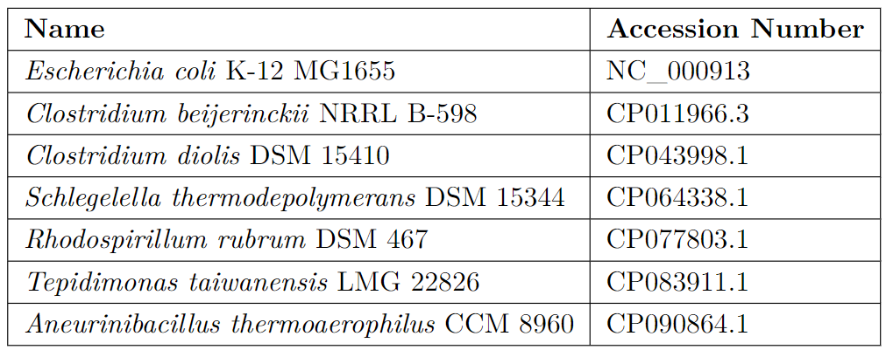

This script was created to simplify the comparison of four tools (eggNOG-mapper, Operon-mapper, Prokka, Batch CD-Search) in my bachelor thesis. Functions in merger.py merge the output files of each tool into the table that contains id, start, end and OG assignment for each CDS and saves it into the tables directory. The script functions_call.py calls the functions in merger.py and the annotation files of following bacterial genomes:

The tools that have been compared are available at:

eggNOG-mapper: https://github.com/eggnogdb/eggnog-mapper

Operon-mapper: https://biocomputo.ibt.unam.mx/operon_mapper/

Prokka: https://github.com/tseemann/prokka

Batch CD-Search: https://www.ncbi.nlm.nih.gov/Structure/bwrpsb/bwrpsb.cgi
